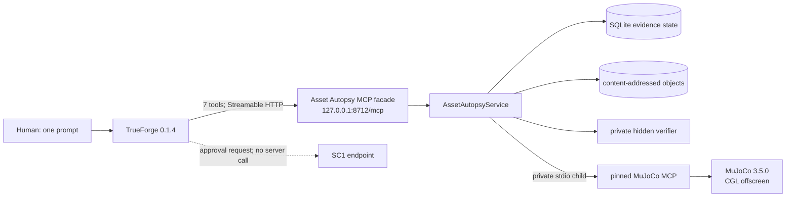

# Asset Autopsy

## Implemented SC1 design

Status: aligned with the implemented thin slice

Date: 2026-08-31

Target: TrueForge Agent Harness Hackathon

Primary case: `compound-arm-01`

## 1. Decision and product claim

Asset Autopsy is a tools-first repair harness for one bounded MuJoCo case. It lets a TrueForge
agent close this loop from one prompt:

```text
observe a fixed public failure
  -> choose a falsifiable hypothesis and competing explanation
  -> choose and analyze a bounded experiment
  -> create one immutable, evidence-backed revision
  -> compare behavior under the same public condition
  -> repeat only when the model decides another repair is needed
  -> qualify against public and hidden contracts
  -> stop at the TrueForge approval request
```

The asset compiles and renders but behaves incorrectly. The agent receives no fault label, golden
file, hidden target, or prescribed repair recipe. The implemented claim is deliberately narrow:

> Asset Autopsy adds a causal evidence loop around an existing simulator so a model can choose an
> experiment and support a bounded repair with observed behavior.

SC1 is a submission candidate, not a published product. The accepted endpoint is the real
TrueForge `tool.approval_required` event for `publish_revision`. The submission never clicks
approval and makes no claim about a publication response or materialized artifact. The decision is
recorded in [the SC1 approval endpoint decision](decisions/sc1-approval-request-endpoint.md).

## 2. Implemented boundary



TrueForge owns the model loop, saved AgentSpec, Large Tool Response handling, Sandbox execution,
and human approval pause. The loopback facade owns bearer/Origin enforcement, strict schemas,
tool annotations, bounded error mapping, and startup preflight. The domain service owns the fixed
fixture, budgets, evidence lineage, metrics, one-attribute patching, and hidden qualification.
Only physics execution is delegated to the private commit-pinned MuJoCo MCP child.

The facade calls the Python domain service directly; it does not shell out to a product CLI. The
thin slice has no separate agent-skill package, TrueForge fork, UI, arbitrary 3D adapter, automatic
qualification recovery, or post-approval materializer. None of those surfaces is a dependency of
SC1.

## 3. Fixed case and public budgets

`compound-arm-01` is a repository-owned primitive three-link arm with:

- three hinge joints: `joint_a`, `joint_b`, and `joint_c`;
- three position actuators: `motor_a`, `motor_b`, and `motor_c`;
- no external mesh, texture, include, plugin, URL, or network asset;
- a fixed public scenario named `public_center`;
- one private three-scenario hidden suite whose raw values never enter public tool results.

`open_case` advertises the topology, public contract, patch policy, current linear head, event tail,
and remaining budgets. The fixed initial budgets are:

| Resource | Budget |
| --- | ---: |
| Total task and experiment runs | 10 |
| Experiments | 5 |
| Child revisions | 2 |
| Hidden qualification attempts | 1 |

The public patch allowlist is `joint.axis`, `joint.damping`, `joint.armature`, and
`joint.frictionloss`. Axis values are normalized non-zero vectors. Scalar safety ranges are
`damping: 0..100`, `armature: 0..10`, and `frictionloss: 0..100`.

## 4. Public tools

The resolved AgentSpec exposes exactly these seven tools:

| Tool | Implemented contract |
| --- | --- |
| `open_case` | Read the pre-provisioned public scenario targets, topology, contract, head, lineage, patch policy, and budgets. |
| `inspect_asset` | Read sanitized authored and compiled values without XML, host paths, fault labels, or hidden values. |
| `run_task` | Execute only `public_center`; a child result includes a same-condition parent `BehaviorDiff`. |
| `run_experiment` | Register a hypothesis and run one bounded model-defined experiment after a public baseline. |
| `create_revision` | Create the next immutable child by changing one allowed joint attribute and citing a completed current-base experiment and hypothesis. |
| `verify_revision` | Recheck the public contract and consume the one-shot hidden qualification, returning only aggregates and a bound ticket on success. |
| `publish_revision` | Request approval for that ticket. It is the only destructive and approval-gated tool; SC1 stops before its server invocation. |

Every input model forbids unknown fields and non-finite numbers. Public calls cannot provide raw
MJCF, local paths, URLs, seeds, timesteps, controller replacements, test replacements, hidden
targets, or hidden scenarios.

## 5. `run_experiment` contract

### 5.1 All-joint and all-actuator boundary

The service validates the complete experiment condition before calling the simulator:

- `initial_joint_positions` names every hinge joint exactly once;
- each initial position is inside that joint's `position_range` returned by `open_case`;
- every segment names every position actuator exactly once;
- every control value is inside that actuator's `control_range` returned by `open_case`;
- every segment controls the same complete actuator set.

For the fixed fixture, all three joint position ranges and all three actuator control ranges are
`[-1.2, 1.2]`. Missing `joint_c`, omitting a motor, repeating a name, adding an unknown name, or
using an out-of-range finite value is rejected before an upstream run.

This is an illustrative valid input shape, not a prescribed experiment strategy:

```json
{
  "case_id": "case_compound-arm-01",
  "revision_id": "r000",
  "hypothesis": {
    "claim": "A joint property changes the observed motion direction.",
    "suspected_elements": [
      {"kind": "joint", "name": "joint_b", "attributes": ["axis"]}
    ],
    "competing_explanation": {
      "claim": "Insufficient damping explains the same public failure.",
      "suspected_elements": [
        {"kind": "joint", "name": "joint_c", "attributes": ["damping"]}
      ],
      "discriminating_reason": "Direction and velocity decay produce different public signals."
    },
    "prediction": "The selected motion signals change in the predicted direction.",
    "falsifier": "The direction is unchanged while the decay pattern explains the failure."
  },
  "initial_joint_positions": [
    {"joint_name": "joint_a", "position_rad": 0.0},
    {"joint_name": "joint_b", "position_rad": 0.0},
    {"joint_name": "joint_c", "position_rad": 0.0}
  ],
  "segments": [
    {
      "label": "model-chosen excitation",
      "n_steps": 384,
      "controls": [
        {"actuator_name": "motor_a", "value": 0.0},
        {"actuator_name": "motor_b", "value": 0.2},
        {"actuator_name": "motor_c", "value": 0.0}
      ]
    }
  ],
  "observables": [
    {"kind": "qpos"},
    {"kind": "qvel"},
    {"kind": "body_position", "body_name": "end_effector"}
  ],
  "capture_final_snapshot": false
}
```

### 5.2 Other bounds and output

The model may choose:

- 1–16 constant-control segments;
- 256–100,000 total simulation steps across those segments;
- 1–8 unique observables from `qpos`, `qvel`, `energy`, `contact_count`, and
  `body_position(name)`;
- whether to request one final 160 × 120 snapshot.

The run remains subject to the implementation's numeric-record budget. Every completed finite
experiment returns condition and execution hashes, segment boundaries, and exactly 256 uniformly
sampled rows. Each row has `time_s` and a named `values` mapping. Canonical keys include
`qpos:<joint>`, `qvel:<joint>`, `energy:potential`, `energy:kinetic`, `contact_count`,
`body_position:<body>:<axis>`, and `control:<actuator>`.

Before evidence persistence, the service derives the exact expected trace columns from the
accepted observables plus the complete actuator list. Missing, duplicated, substituted, reordered,
or unexpected columns fail closed instead of becoming evidence.

The tool records the model's claim, competing explanation, prediction, and falsifier but does not
decide whether any of them is true. It returns no predicate-matched boolean or diagnosed cause.
TrueForge may offload the large response; the model chooses how to inspect and analyze that file in
Sandbox. Python, a fixed reducer, exact stdout, and a fixed number or order of experiments are not
part of the product contract.

## 6. Model-chosen repair strategy and evidence binding

The saved instructions define the goal, public-data boundary, budgets, patch policy, success
criteria, and approval stop. They leave these decisions to the model:

- which authored or compiled values to inspect;
- which hypotheses and competing explanations to test;
- the initial condition, segments, controls, step count, and observables;
- the Sandbox analysis method;
- the candidate joint attribute and replacement value;
- whether another experiment or revision is needed.

The event evaluator grades observable outcomes instead of a fixed source shape. Before every
revision, it requires a completed experiment on that revision's current base, a Large Tool
Response path, and a successful later Sandbox execution that references that path. The revision
must cite the run and hypothesis, return one matching canonical diff, and extend the current linear
head. The final `run_task` must pass and return a changed `public_pass` `BehaviorDiff`.

The implemented depth is one or two child revisions. At least one evidence-backed revision is
needed for the SC1 outcome, but neither the prompt nor evaluator requires exactly two experiments,
two revisions, 256 simulation steps, or a particular analysis program.

## 7. Qualification contract

`verify_revision` accepts the current child head when it is within the two-revision budget and its
latest public task passed. It independently reruns the public condition, verifies immutable
lineage and stored object identities, reserves the case's single qualification attempt, and runs
three private scenarios.

The public result contains only:

- public aggregate `1/1` on success;
- hidden aggregate `3/3` on success;
- public clause IDs when a public clause is violated;
- a digest-bound promotion ticket when both suites pass.

It never returns hidden scenario definitions, targets, individual hidden results, or hidden
traces. A repeated request after a complete `PASSED` or `FAILED` terminal commit may return that
stored terminal result; this preserves idempotency after response loss without re-executing the
hidden suite. An interrupted or otherwise nonterminal attempt is not resumed or automatically
recovered, exposes no partial hidden result or ticket, and requires a fresh pre-provisioned case.

## 8. Approval endpoint

The AgentSpec marks only `publish_revision` as destructive and lists it as the sole approval-
required tool. A successful SC1 turn submits the exact ticket returned by qualification and then
stops at the matching `tool.approval_required` event.

At that accepted endpoint:

- the user has not clicked Approve;
- there is no `publish_revision` tool response;
- the facade publish invocation count is zero;
- the domain publish invocation count is zero;
- no publication materializer or promotion-persistence path exists.

If an approved request is sent to the domain outside the accepted submission flow,
`publish_revision` returns the sanitized non-retryable `PUBLICATION_DEFERRED` error before any
storage or filesystem mutation. This fail-closed behavior is a safety boundary, not a publication
feature or a second demo path.

## 9. Security and error boundaries

- The MCP facade binds only to `127.0.0.1`, requires a per-run bearer, and accepts only the
  configured loopback TrueForge Origin.
- Startup preflight validates the immutable fixture through the real runner before serving tools;
  upstream drift fails startup closed with a bounded code.
- Public validation errors expose only bounded field paths and safe error categories.
- Domain and upstream errors contain a code, safe message, retryability flag, request ID, and
  bounded next action; they do not contain stack traces, raw XML, secrets, host paths, or hidden
  values.
- Revision patching operates only on service-owned fixture bytes and rejects XML declarations,
  namespaces, document-level nodes, DTD/entity content, includes, plugins, external assets, paths,
  URLs, excessive size/depth/elements, and unapproved attributes.
- An interrupted simulator call does not resume from partial physics state. Any retry is a new,
  separately recorded public call subject to remaining budgets.

## 10. AgentSpec and real-model evidence

`src/asset_autopsy/trueforge_client.py` builds the dedicated `asset-autopsy-sc1` AgentSpec. The
implemented settings use `openai/gpt-5-6-sol`, high reasoning effort, serial tool calls, a
30-iteration limit, enabled Sandbox file downloads and Large Tool Response, no dynamic subagents,
and approval only for `publish_revision`.

The developer evidence driver `scripts/run_sc1_e2e.py`:

1. creates an isolated temporary service root and bearer;
2. starts the loopback MCP facade;
3. verifies and provisions only the dedicated agent/connector in the normal TrueForge runtime;
4. sends the exact one-prompt task;
5. evaluates the raw event sequence and runtime state;
6. writes a sanitized PASS artifact or a bounded blocker artifact.

A unit test, scripted event fixture, mergeable PR, or green local suite does not prove that the
saved real model completed SC1. A PASS claim additionally requires the sanitized artifact for the
exact Git commit, a completed turn, evidence-backed revisions, final public pass, hidden `3/3`,
the matching approval request with no response, zero facade/domain publish invocations, verified
ledger state, and no private-boundary leakage.

## 11. Current repository map

The implemented production and evidence surfaces are:

```text
README.md
docs/
  asset-autopsy-mvp-design.md
  asset-autopsy-issue-plan.md
  decisions/sc1-approval-request-endpoint.md
  sc1-demo-runbook.md
fixtures/compound-arm-01/asset.mjcf
scripts/run_sc1_e2e.py
src/asset_autopsy/
  fixture.py
  mcp_server.py
  metrics.py
  mujoco_client.py
  patcher.py
  qualification.py
  runner.py
  schemas.py
  service.py
  storage.py
  task_evaluation.py
  trueforge_client.py
tests/
  e2e/
  integration/
  unit/
  upstream_contract/
```

This map intentionally contains no product CLI, separate Skill tree, publisher module, advanced
recovery suite, future evidence-manifest schema, or multi-format adapter.

## 12. Reproducible commands

From a fresh checkout:

```bash
npm ci
uv sync --frozen
uv run pytest -q
git diff --check
```

The local suite is not a substitute for the SC1 real-model run. To exercise that gate, start the
normal saved TrueForge runtime and the developer driver in separate terminals:

```bash
npm run trueforge
```

```bash
uv run python scripts/run_sc1_e2e.py
```

The driver must be allowed to stop at approval. Do not approve the request during the submission
run.
